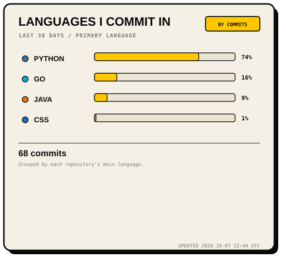
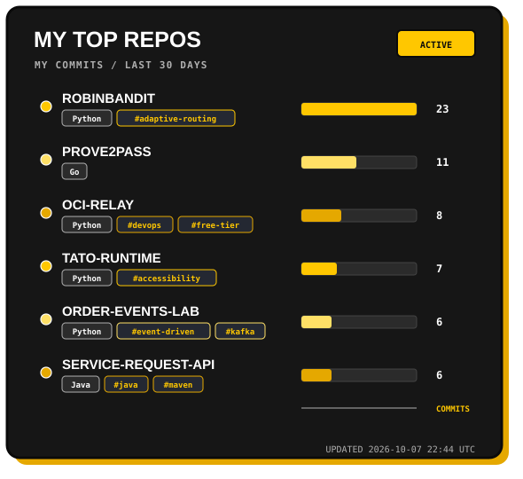

# 🎨 GitHub Metrics Cards

Beautiful, dynamic, customizable GitHub profile metrics cards. Pick your palette, set your username, and let GitHub Actions keep your profile updated automatically.

## Live cards






## What the numbers mean

- The calendar uses GitHub's actual contribution calendar, not simulated activity. Contributions are not limited to commits.
- The repository ranking counts recent commits attributed to your account in repositories you own. Forks and your profile repository are excluded.
- `recent_commits` weights each repository's primary language by its recent commit count. It does not measure the language of every changed line. `code_size` uses repository language bytes instead.
- Public repositories are used by default. Calendar totals follow GitHub's visibility settings and can differ from the public repository ranking.

The update time is recorded in `assets/metrics/metrics.json`, not displayed on the cards. Collection errors stop generation and preserve previous output; no invented statistics are substituted. Files under `examples/` are explicitly marked demos.

## Embed in your profile

Replace `YOUR_USERNAME` after the first successful workflow run:

```markdown


```

Filenames remain stable. GitHub can cache embedded images; check the raw SVG and the latest successful workflow run first.

## Run locally

Python 3.13 is used in CI; no additional Python packages are required.

```sh
python -m unittest discover -s tests -v
python scripts/generate_metrics.py --github-cli
python scripts/generate_examples.py
python -m http.server 8769
```

The generator uses an already authenticated GitHub CLI. Alternatively, provide `METRICS_TOKEN` or `GITHUB_TOKEN` through the environment and omit `--github-cli`. Open `http://localhost:8769` to preview live cards separately from theme demos.

---

## 🎨 3 Initial Themes

### 1. `neobrutalist` (Signature Paper & Voltage Yellow)
A warm, tactile neobrutalist aesthetic with paper tones, bold outlines, and voltage yellow highlights.

### 2. `dark-minimal` (Sleek Dark Mode & Blue Accent)
A clean, modern dark theme built with deep charcoal backgrounds and electric blue accents.

### 3. `cyberpunk` (Neon Hacker & Deep Purple)
A high-contrast cyberpunk theme featuring matrix green, electric cyan, and neon magenta.

---

## 🚀 Quick Start (3 Steps)

### 1. Fork this repository
Click the **Fork** button at the top right of this page to create your own copy.

### 2. Edit `config.yml`
Open `config.yml` and change `username` to your GitHub handle:

```yaml
username: "YOUR_GITHUB_USERNAME"
theme: "neobrutalist" # Options: neobrutalist | dark-minimal | cyberpunk
```

### 3. Enable GitHub Actions
Go to your forked repo's **Actions** tab, enable workflows, and click **Run workflow** on "Update GitHub Metrics Cards". Allow workflows to write repository contents under Settings → Actions → General → Workflow permissions. Generation also runs daily and when generator configuration changes on `main`.

---

## 🔒 Optional: Private Repositories & Full Stats

By default, the cards render public repositories. To include private repositories:
Set `include_private: true` in `config.yml` as well as providing a token with access. Generated SVGs and `metrics.json` are committed: **private names and activity become public if this repository is public**. Keep the setting off unless you intend that disclosure. Never commit tokens.
1. Generate a Personal Access Token (PAT) with `repo` scope under **GitHub Settings ➔ Developer Settings ➔ Personal access tokens**.
2. Add it as a Repository Secret named `METRICS_TOKEN` under **Repo Settings ➔ Secrets and variables ➔ Actions**.

---

## 📄 License
MIT License. Free to use, modify, and distribute!
